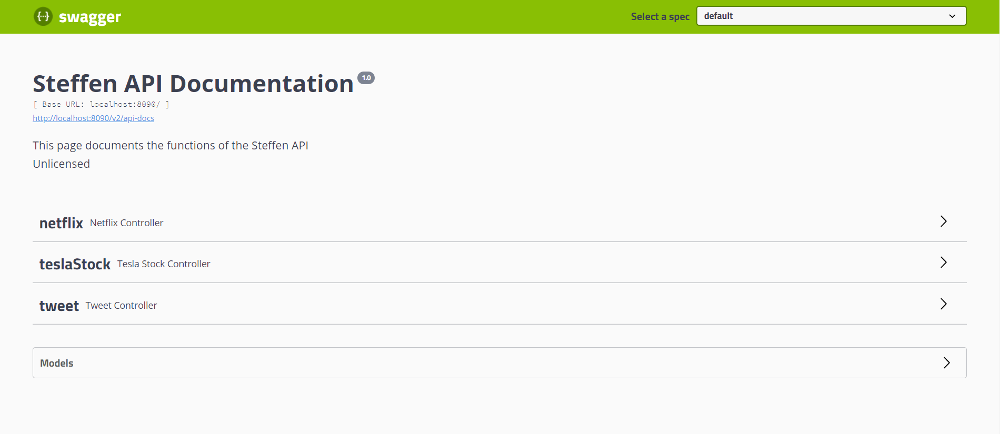

# The Steffen API

---

This API was created in partial completion of the data processing course of NHL Stenden

---

## !Important 

### Make sure you have a database called `data_processing` in your local database system

---

## Instructions to run from compiler
___
1. A local database system is required to run this API.
2. Install Maven here: [instructions from the Maven website](https://maven.apache.org/install.html)
3. Make sure all maven dependencies from the [pom.xml](pom.xml) file are installed
   3.1 Make sure Maven is properly configured in the system environment variables, and that you can access it 
   in your terminal
4. Run `mvn clean compile` followed by `spring-boot:run`, or just `mvn clean compiler spring-boot:run`.
5. If done correctly the following should be displayed in the project terminal:


```
  .   ____          _            __ _ _
 /\\ / ___'_ __ _ _(_)_ __  __ _ \ \ \ \
( ( )\___ | '_ | '_| | '_ \/ _` | \ \ \ \
 \\/  ___)| |_)| | | | | || (_| |  ) ) ) )
  '  |____| .__|_| |_|_| |_\__, | / / / /
 =========|_|==============|___/=/_/_/_/
 :: Spring Boot ::        (v1.5.9.RELEASE)

```

### The command line should stop with the following: 

```
2021-01-15 13:43:35.830  INFO 31248 --- [           main] s.b.c.e.t.TomcatEmbeddedServletContainer : Tomcat started on port(s): 8090 (http)
2021-01-15 13:43:35.834  INFO 31248 --- [           main] org.steffen.Application                  : Started Application in 13.309 seconds (JVM running for 22.88)
```

---

## Instructions to run from .jar file

---

1. Make sure you have a local database environment running
2. Run Steffen.jar (target/Steffen.jar) in an environment where you can stop it (e.g. intellij)
3. If done correctly, the same text should be displayed in the terminal as in step 4 and 5 of the previous section

---

## Documentation

This API uses Swagger to document its functionality.
Once the API is running in your local system, access the documentation page through `/swagger-ui.html` 
on port 8090 of your local host.

The link should look like [http://localhost:8090/swagger-ui.html](http://localhost:8090/swagger-ui.html)

Once accessed the following display will be shown:



This link documents all the CRUD operations which the API can perform.

---
#Additions

The visualizer for this API's data can be found [here](https://github.com/AlsoSteffen/steff-data-processing)